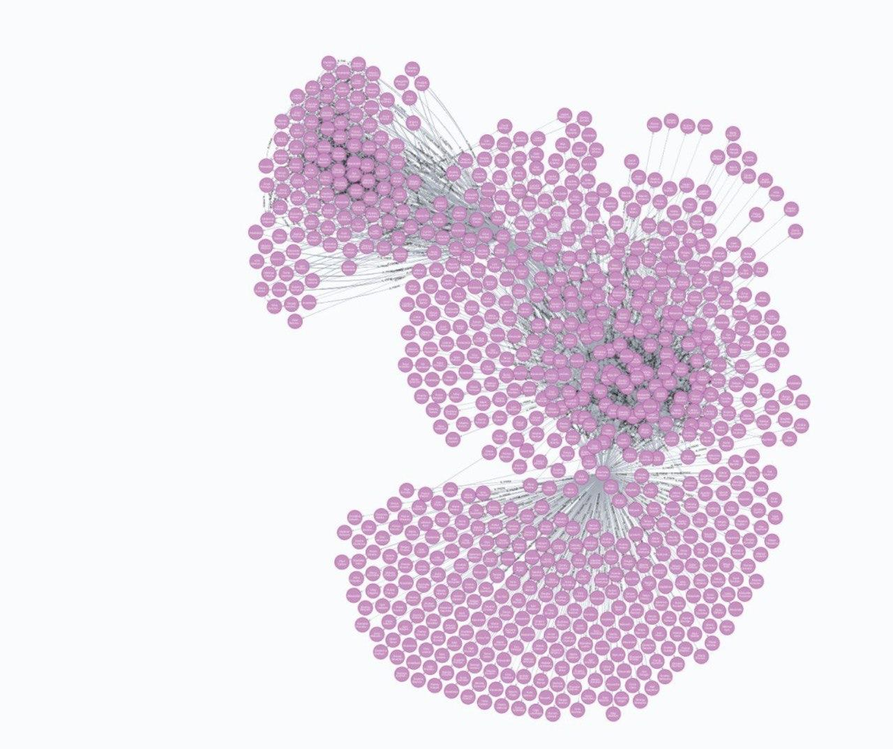
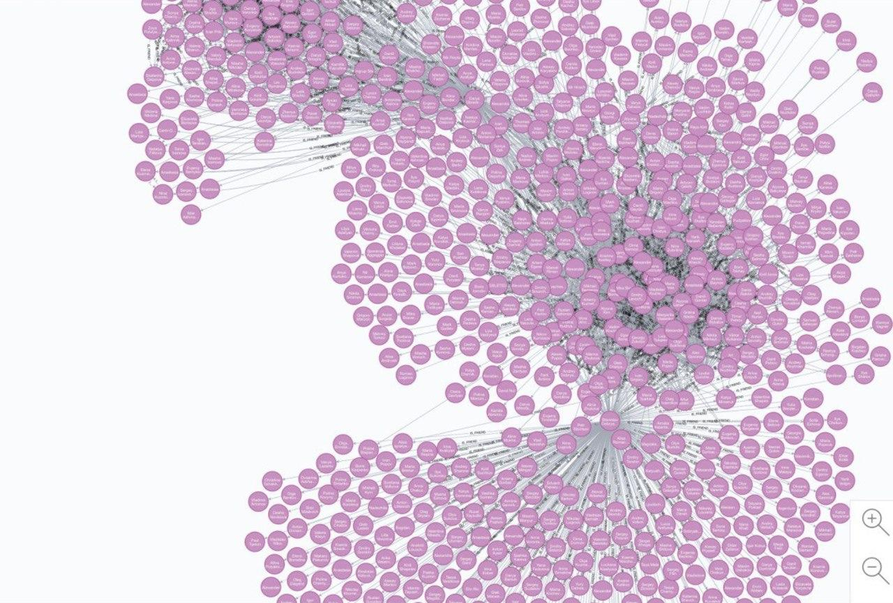
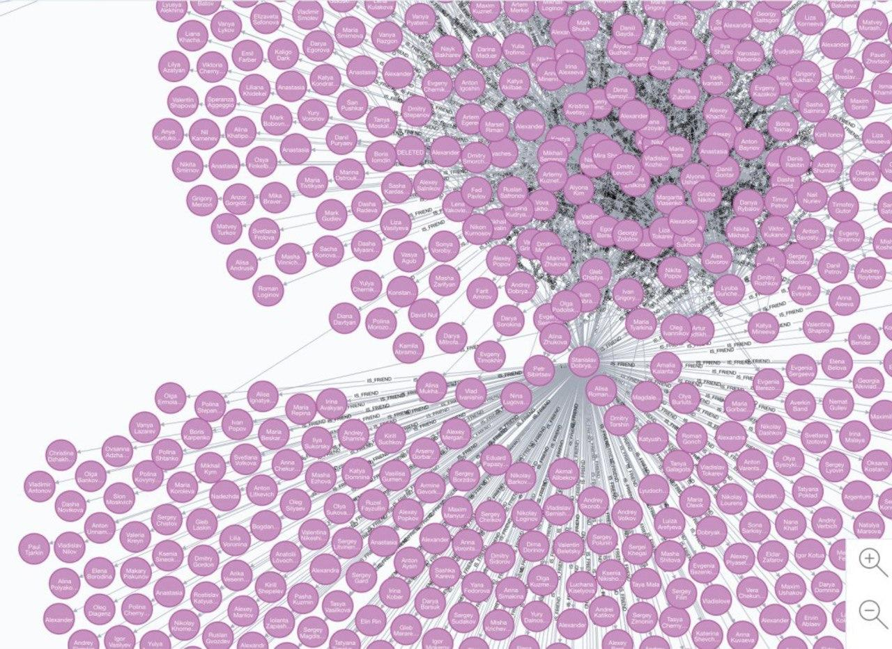
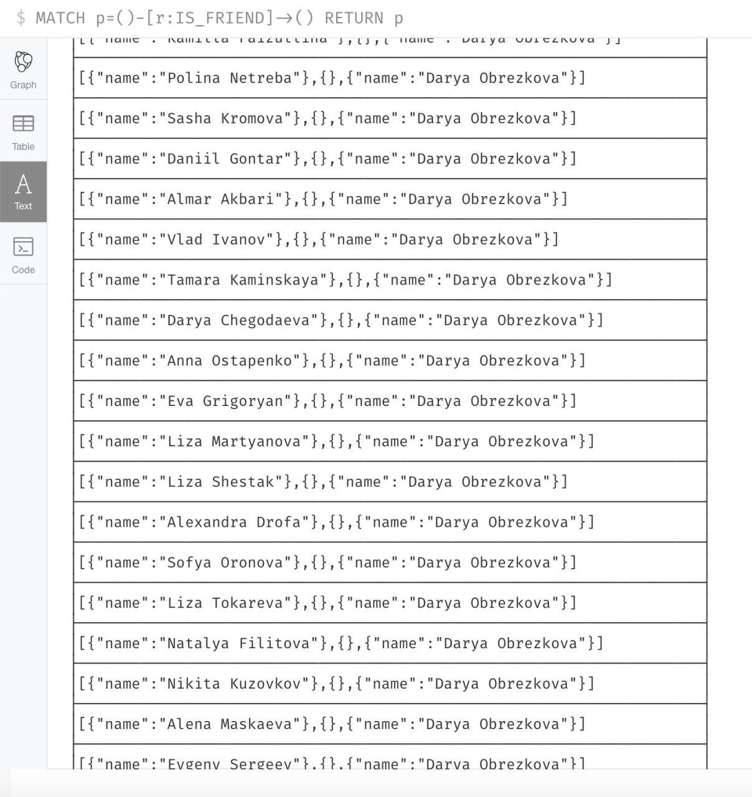

# Команда VK DNS

## Работу выполнили:
Дарья Обрезкова, Наталья Бернштейн, Станислав Добряков

## Описание графа:
Граф содержит выгрузку из пользоваталей социальной сети ВКонтакте - наших друзей (Бернштейн Натальи, Добрякова Станислава, Обрезковой Дарьи) со связями между ними. Вершинами графа являются пользователи, связь IS_FRIEND обозначает "дружбу" между пользователями.

## Описание методов:
Для сбора данных был использован VK API (https://vk.com/dev/manuals) и язык программирования Python + библиотека py2neo (https://py2neo.org/v4/) для работы с neo4j. Для хранения и визуализации графа использовалась DBMS neo4j.
Граф хранится в виде списка ребер.

### Визуализация в neo4j:

### Часть списка ребер в neo4j:

