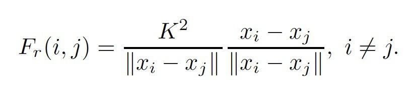
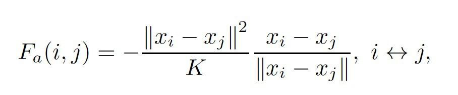

# Команда VK DNS

## Работу выполнили:
Дарья Обрезкова, Наталья Бернштейн, Станислав Добряков

# Лабораторная работа 1

## Описание графа:
Граф содержит выгрузку из пользователей социальной сети ВКонтакте - наших друзей (Бернштейн Натальи, Добрякова Станислава, Обрезковой Дарьи) со связями между ними. Вершинами графа являются пользователи, связь IS_FRIEND обозначает "дружбу" между пользователями.

## Описание методов:
Для сбора данных был использован VK API (https://vk.com/dev/manuals) и язык программирования Python + библиотека py2neo (https://py2neo.org/v4/) для работы с neo4j. Для хранения и визуализации графа использовалась DBMS neo4j.
Граф хранится в виде списка ребер.

### Визуализация в neo4j:

### Часть списка ребер в neo4j:

# Лабораторная работа 2

## Выбранный алгоритм: 
Нами был выбран spring-electrical алгоритм. Основной идеей этого алгоритма является то, что граф представляется как электрически заряженные вершины (таким образом, вершины отталкиваются друг от друга электрическими силами), соединенные пружинами. 
Между любой вершиной и ее соседями существует некоторая сила притяжения, вычисляемая по следующей формуле: 
 

 
Одновременно между любыми двумя различными вершинами существует отталкивающая сила, формула которой приложена ниже: 

 
Здесь x_i обозначает координаты вершины i, а параметр K отвечает за длины ребер в финальном расположении вершин. 
Алгоритм строится следующим образом: 
 1. Исходно точки располагаются произвольным образом 
 2. Для каждой вершины вычисляется сумма действующих на нее сил (как притягивающих, так и отталкивающих) 
 3. Каждая вершина сдвигается в направлении, соответствующем результирующей силе, на некоторое расстояние (step). 
 4. Процесс повторяется, при этом step уменьшается с каждым шагом. 
 5. Процесс заканчивается, когда расположение точек стабилизируется, то есть когда после определенного шага сдвиг вершин не превосходит некоторого порога. 
 
## Реализация: 
Для реализации алгоритма использовался язык Python и Jupyter Notebook. Алгоритму на вход подается граф, хранящийся в виде списков смежности. Написанный код можно найти на github (ссылка указана выше). 
Для визуализации графа с уже найденными координатами использовалась библиотека networkx (https://networkx.github.io (https://networkx.github.io/)), конкретно функция draw_networkx, и библиотека matplotlib (https://matplotlib.org (https://matplotlib.org/)). 
 
## Данные и результаты: 
Реализованный алгоритм был протестирован на данных, описанных в лабораторной работе N1, а также на двух меньших графах: 
1. Граф, в котором лишь вершины, соответствующие членам команды VK DNS, соединены с другими вершинами 
2. Граф, в котором оставлены лишь те ребра, одним из концов которых является вершина, имеющая минимум 50 соседей в исходном графе (то есть вершины, имеющие большое количество общих друзей с членами команды VK DNS). 

Результаты и сравнения их с другими методами networkx представлены в папке команды в OneNote и в Jupyter Notebook "Lab 2".

Заметим, что, тогда как в результатах работы нашего алгоритма прослеживается определенная структура расположения точек, она отсутствует в визуализациях, полученных при помощи networkx.draw_circular и networkx.draw_random. При этом на изображениях, полученных при помощи networkx.draw_spectral, точки сливаются друг с другом, затрудняя понимание этой структуры.
