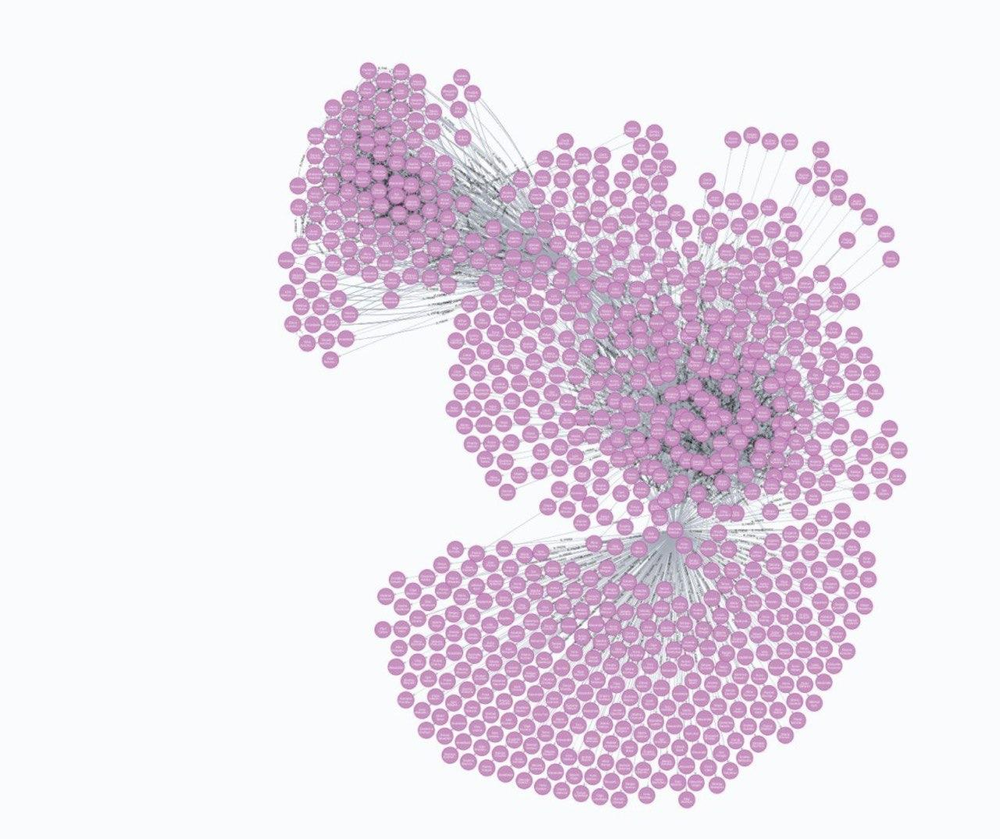
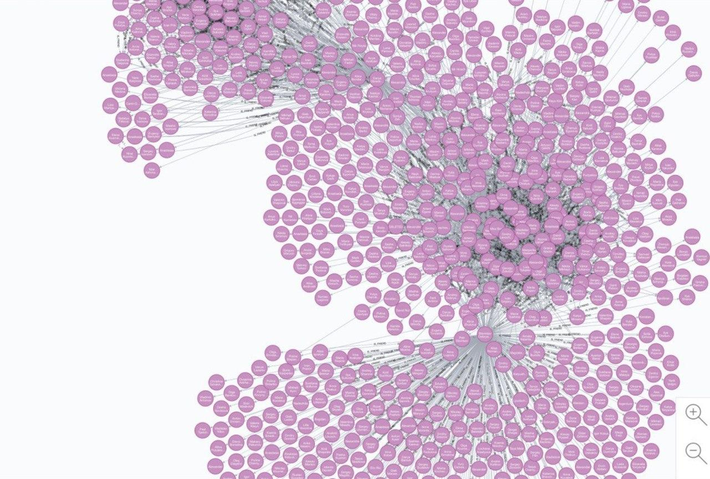
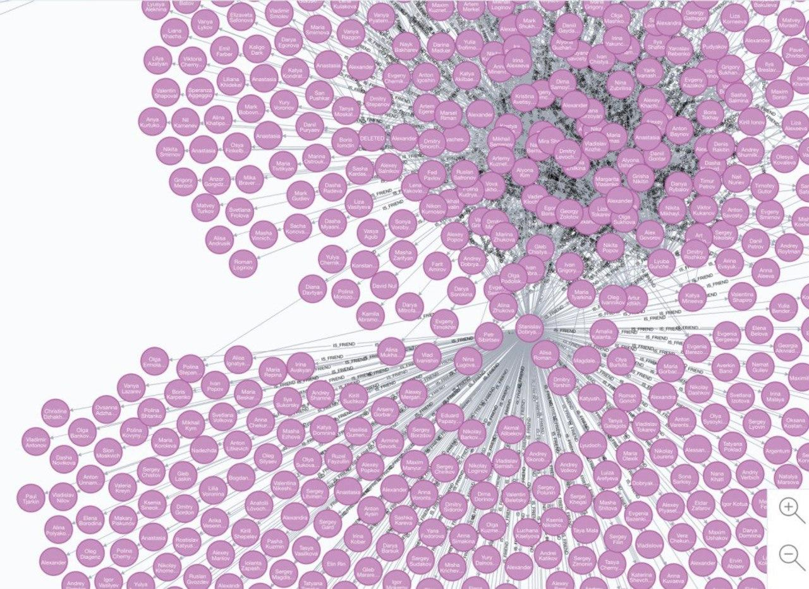

# graph_viz

## Работу выполнили

Дарья Обрезкова, Наталья Бернштейн, Станислав Добряков

## Граф VK DNS

Граф содержит выгрузку из 700 человек - наши друзья (Бернштейн Натальи, Добрякова Станислава, Обрезковой Дарьи). 

Для сбора данных был использован VK API и язык программирования Python. Для хранения и визуализации графа использовался neo4j.

Format: 

Format: 

Format: 
